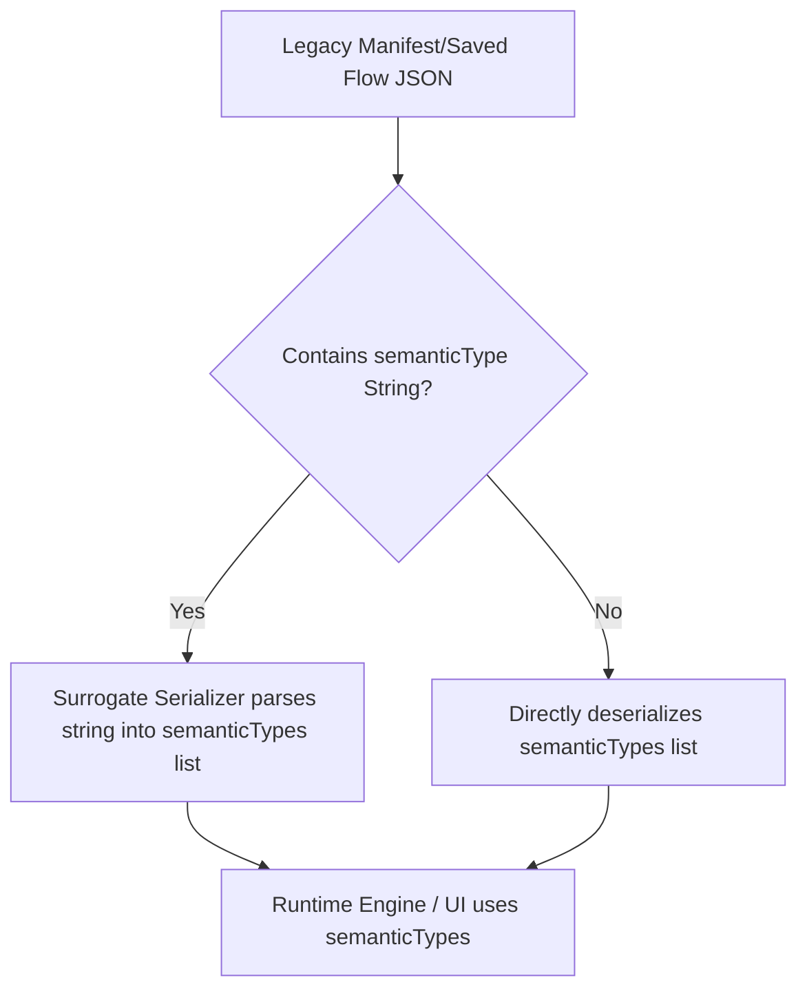

# Semantic Types Infrastructure

This document defines the architecture, grammar, standard registry, matching compatibility rules, and migration plan for Semantic Types within the Plugin Toolkit.

---

## 1. Overview

In the Plugin Toolkit, ports are strongly typed with Kotlin data types (`DataType`), but also annotated with **Semantic Types**. While `DataType` dictates binary/memory representations (e.g. `String`, `ByteArray`), a `SemanticType` dictates the domain-specific contract of the data (e.g. "is this string a file path?", "is it a hex color?", "is it an image URL?").

To support modern, highly-extensible pipelines, ports support **multi-valued semantic types** (`List<SemanticType>`). This allows a single output to satisfy multiple downstream contracts, or an input to accept multiple semantic structures.

---

## 2. Grammar & Structured Identity

Every `SemanticType` has a structured identity:
- **Namespace (Optional)**: Avoids collisions between different plugin ecosystems (e.g. `sys/` vs `wip/` vs custom domains).
- **Name (Required)**: The primary semantic category (e.g. `color`, `file`, `image`).
- **Variant (Optional)**: Specialization or subtype (e.g. `rgb`, `png`, `path`).

### String Representation (Grammar)
Annotations and serialized manifests represent semantic types using the following standard format:
```
[namespace/][name][:variant]
```

#### Parsing & Normalization Rules:
1. **Normalization**: All namespace, name, and variant parts are trimmed, converted to lowercase, and Unicode NFKC normalized.
2. **MIME Fallback**: Standard MIME types (e.g. `image/png`) are parsed gracefully with `name = "image"` and `variant = "png"`.
3. **Delimiter Syntax**:
   - `/` separates the namespace and name.
   - `:` separates the name and variant.
   
#### Examples:
- `sys/color:hex` &rarr; Namespace: `sys`, Name: `color`, Variant: `hex`
- `file:path` &rarr; Namespace: `null`, Name: `file`, Variant: `path`
- `image/png` &rarr; Namespace: `null`, Name: `image`, Variant: `png`
- `color` &rarr; Namespace: `null`, Name: `color`, Variant: `null`

---

## 3. Standard Semantic Registry

To ensure interoperability across independent plugins, the system recognizes a set of standard namespaces and types under the `sys` namespace.

### Centralized Priority Categories
The `SemanticRegistry` resolves a `List<SemanticType>` into one of the following high-priority visual categories:
1. **COLOR** (`sys/color`) - Triggers UI color picker controls.
2. **IMAGE** (`sys/image`, `image/*`) - Triggers inline image previews.
3. **AUDIO** (`sys/audio`, `audio/*`) - Triggers audio player UI.
4. **VIDEO** (`sys/video`, `video/*`) - Triggers video player UI.
5. **FILE** (`sys/file`, `sys/directory`, `application/*`) - Triggers file picker UI.
6. **PATH** (`sys/path`) - Triggers local path explorer.

### Visual Priority Resolution
When a port lists multiple semantic types, the category is determined by the highest-priority match in the list above. For example, if a port lists `[sys/image:png, sys/file:path]`, the resolved category is `IMAGE`.

---

## 4. Connection Compatibility & Matching Rules

When connecting an output port (source) to an input port (target), compatibility is checked using the `isSemanticTypeCompatible` algorithm.

### General Rules:
1. **Null/Empty List Safety**: If either the source or target has an empty semantic types list, they are deemed universally compatible.
2. **Any-to-Any Check**: A connection is valid if **at least one** `SemanticType` in the source list matches **at least one** `SemanticType` in the target list.

### Semantic Matcher Logic:
For two individual `SemanticType` objects (source `S`, target `T`), a match is established if:
1. **Identity**: `S.namespace == T.namespace && S.name == T.name && S.variant == T.variant`.
2. **Generalization**: The source is specialized but the target is general.
   - e.g. Source `sys/color:rgb` matches Target `sys/color`.
3. **Lenient Specialization** (Enabled by default): The source is general but the target is specialized.
   - e.g. Source `sys/color` matches Target `sys/color:hex`.
4. **Wildcards**: The target specifies a wildcard `*` variant, or name/namespace wildcards.
   - e.g. Source `image/png` matches Target `image/*`.

---

## 5. Deprecation & Migration Plan

The transition from single-string `semanticType` to structured `List<SemanticType>` maintains backwards compatibility to protect existing flows and third-party plugins.



### 1. Code-Level Deprecations
The old `semanticType: String?` property is deprecated across all models and annotations:
- **Annotations**: `@Parameter`, `@Output`, `@Capability` now support a `semanticTypes: Array<String>` parameter (defaulting to empty).
- **Metadata Models**: `ParameterMetadata`, `OutputMetadata`, `CapabilityMetadata` retain `semanticType: String?` as a deprecated property but introduce `semanticTypes: List<SemanticType>`.

### 2. JSON Deserialization Backwards Compatibility
To handle older plugins and saved flow files:
- Custom `JsonTransformingSerializer` layers are implemented on `InputPort`, `OutputPort`, and manifest data structures.
- If a JSON payload contains `semanticType: "sys/color"` but lacks `semanticTypes`, the parser automatically parses the legacy string and populates the `semanticTypes` list containing `SemanticType(namespace="sys", name="color")`.

### 3. KSP Generator Alignment
- The KSP code generators write output utilizing the new `semanticTypes` property.
- To prevent compilation breakage in older codebases referencing generated templates, the legacy `semanticType` string is also outputted as a concatenated canonical string (e.g. `"sys/color:hex"`).
